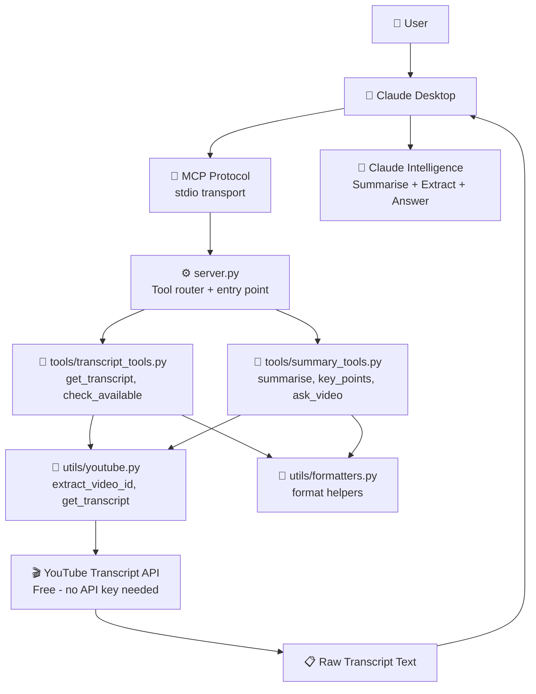
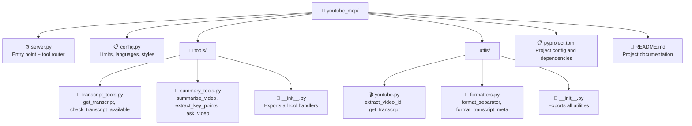

# 📺 YouTube Summariser MCP Server

A modular Model Context Protocol (MCP) server that gives Claude Desktop
the ability to fetch, summarise, and extract key points from any YouTube
video — 100% free, no API key required.


---

## 🌟 What This Project Does

Instead of watching an entire YouTube video, ask Claude Desktop to do it
for you:

- *"Summarise this YouTube video in bullet points"*
- *"Extract the 5 most important key points from this video"*
- *"What does this video say about LangChain agents?"*
- *"Check if this video has a transcript available"*

Claude fetches the transcript automatically and uses its own intelligence
to summarise, extract, and answer — no external LLM API needed.

---

## 🏗️ Architecture



---

## 📁 Project Structure



---

## 🛠️ 5 Available Tools

### 📄 Transcript Tools

| Tool | Description |
|---|---|
| `check_transcript_available` | Check if transcript exists and list available languages |
| `get_transcript` | Fetch the full raw transcript of a video |

### 📝 Summary Tools

| Tool | Description |
|---|---|
| `summarise_video` | Summarise in brief, detailed, or bullet style |
| `extract_key_points` | Extract top N key points ordered by importance |
| `ask_video` | Answer a specific question using the transcript |

---

## ✨ Features

| Feature | Description |
|---|---|
| 🆓 **100% Free** | Uses `youtube-transcript-api` — no API key needed |
| 🌐 **Multi-language** | Supports English transcripts — manual and auto-generated |
| 🎨 **3 Summary Styles** | Brief, detailed, or bullet point summaries |
| 🔢 **Flexible Key Points** | Extract 1 to 10 key points per video |
| ❓ **Video Q&A** | Ask any question — Claude answers from transcript only |
| 🔗 **URL Flexibility** | Supports all YouTube URL formats and raw video IDs |
| 🧱 **Modular Architecture** | Clean separation of transcript, summary, and utility layers |
| ⚡ **No LLM API Cost** | Claude Desktop does the summarisation — no extra API calls |

---

## 🔗 Supported URL Formats

All of these work:
```
https://www.youtube.com/watch?v=dQw4w9WgXcQ
https://youtu.be/dQw4w9WgXcQ
https://youtube.com/shorts/dQw4w9WgXcQ
https://www.youtube.com/embed/dQw4w9WgXcQ
dQw4w9WgXcQ   ← raw video ID also works
```

---

## 🏛️ Why Modular Architecture?

This project uses **Approach 2 — Modular Structure**:

```
config.py               → constants only
utils/youtube.py        → transcript fetching only
utils/formatters.py     → formatting only
tools/transcript_tools  → transcript operations only
tools/summary_tools     → summarisation operations only
server.py               → routing only
```

Each layer has a single responsibility — making it easy to extend,
test, and maintain.

---

## 🚀 Getting Started

### Prerequisites
- Python 3.12+
- Claude Desktop app
- `uv` package manager
- Internet connection (to fetch YouTube transcripts)

### 1. Clone the repository
```bash
git clone https://github.com/keerthihp96/youtube-summariser-mcp.git
cd youtube-summariser-mcp
```

### 2. Install dependencies
```bash
uv add mcp youtube-transcript-api
```

### 3. Test the server
```bash
uv run python server.py
```
No output and no error means it's working. Press **Ctrl+C** to stop.

### 4. Find your uv path
```bash
which uv
# e.g. /Users/yourname/.local/bin/uv
```

### 5. Configure Claude Desktop

Open config file:
```bash
open -e ~/Library/Application\ Support/Claude/claude_desktop_config.json
```

Add the `youtube-summariser` entry:
```json
{
  "mcpServers": {
    "youtube-summariser": {
      "command": "/Users/yourname/.local/bin/uv",
      "args": [
        "run",
        "--project",
        "/full/path/to/youtube_mcp",
        "python",
        "/full/path/to/youtube_mcp/server.py"
      ]
    }
  }
}
```

### 6. Restart Claude Desktop
```bash
pkill -f "Claude"
```

Then reopen Claude Desktop from Applications.

### 7. Test it
```
Summarise this YouTube video:
https://www.youtube.com/watch?v=dQw4w9WgXcQ
```

---

## 💬 Example Conversations

**Summarise in bullet points:**
```
You:    Summarise this video in bullet points:
        https://www.youtube.com/watch?v=abc123

Claude: 📺 Video Summary
        • The video introduces LangChain agents and their use cases
        • ReAct pattern is explained as Thought → Action → Observation
        • Seven tools are demonstrated for SQL generation and execution
        • The agent automatically retries on errors using fix_sql_error
        • Groq LLaMA 3.3 is recommended for fast inference speeds
```

**Extract key points:**
```
You:    Extract 5 key points from this video:
        https://www.youtube.com/watch?v=abc123

Claude: 🔑 Key Points

        1. **ReAct Agent Pattern** — Agents reason step by step using
           Thought, Action, and Observation loops before answering.

        2. **Tool Specialisation** — Each tool handles one specific task,
           making the system modular and easy to debug.

        3. **LLM Fallback** — Primary model falls back to Mixtral
           automatically if rate limits are hit.

        4. **Conversation Memory** — LangChain memory enables natural
           follow-up questions without repeating context.

        5. **Auto Error Recovery** — Agent fixes failed SQL and retries
           without any user intervention.
```

**Ask a specific question:**
```
You:    What does this video say about Snowflake?
        https://www.youtube.com/watch?v=abc123

Claude: Based on the transcript, the video explains that Snowflake is
        used as the target database for the Text2SQL agent. The agent
        connects to Snowflake using the snowflake-connector-python
        library and executes validated SQL queries against it.
```

**Check transcript availability:**
```
You:    Does this video have a transcript?
        https://www.youtube.com/watch?v=abc123

Claude: ✅ Transcripts available:

        Available languages:
          • English (en) — manual
          • English (en-US) — auto-generated
```

---

## ⚙️ Configuration Options

All settings are in `config.py`:

```python
MAX_TRANSCRIPT_LENGTH = 15000   # Max characters sent to Claude
MAX_KEY_POINTS        = 10      # Max key points extractable
TRANSCRIPT_LANGUAGES  = ["en", "en-US", "en-GB"]  # Language preference
SUMMARY_STYLES        = ["brief", "detailed", "bullet"]
```

---

## ⚠️ Limitations

| Limitation | Reason |
|---|---|
| Videos without captions | Transcript API requires captions to be enabled |
| Private or age-restricted videos | YouTube restricts access |
| Very long videos | Transcripts truncated at 15,000 characters |
| Non-English videos | Currently supports English only |

---

## 🔍 Troubleshooting

**Server disconnects in Claude Desktop:**
```bash
cat ~/Library/Logs/Claude/mcp-server-youtube-summariser.log
uv pip install "mcp>=1.0.0" --upgrade
```

**Transcript not found:**
- Check if the video has captions enabled
- Try `check_transcript_available` tool first
- Some videos disable transcripts by owner

**Hammer icon not showing:**
- Use full path to `uv` — run `which uv`
- Fully quit Claude with `pkill -f "Claude"` and reopen
- Validate your JSON config has no syntax errors

---

## 🔒 Privacy

- No data is stored locally
- Transcripts are fetched in real time and passed directly to Claude
- Nothing is sent to any external server other than YouTube
- No API keys or credentials required

---

## 📄 License

MIT License — feel free to use this as a template for your own MCP servers.

---

## 👩‍💻 Author

**Keerthi Vinukonda**
- LinkedIn: https://www.linkedin.com/in/keerthi-v-4022a8263/
- GitHub: github.com/keerthihp96
